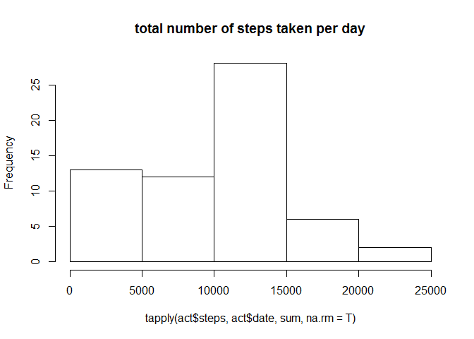
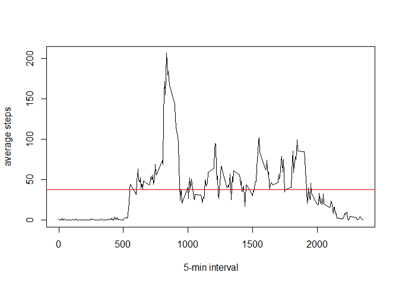
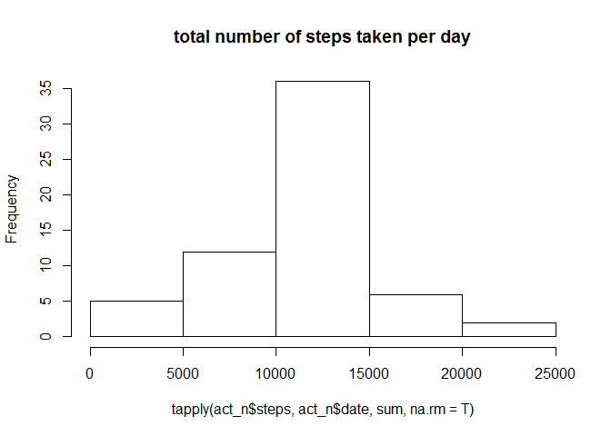
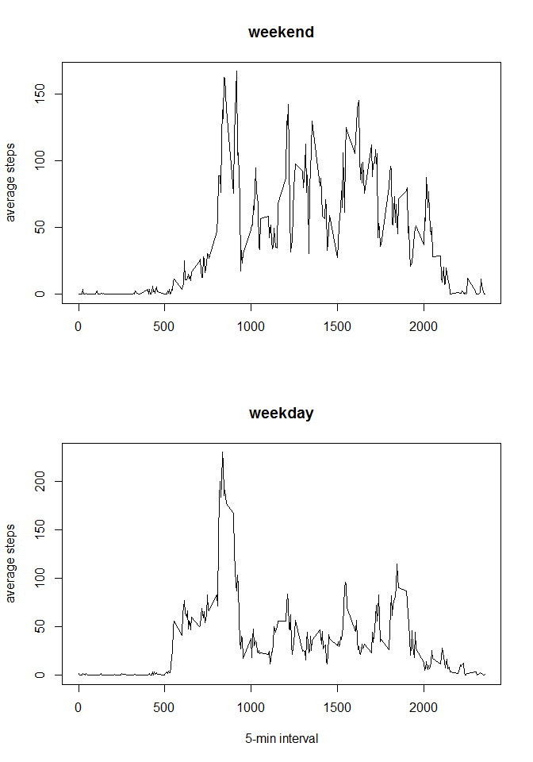

# Reproducible Research: Peer Assessment 1

This project has not need to load any package.

## Loading and preprocessing the data
Load the data from the zip file and store in 'act'. 


```r
act <- read.csv(unz("activity.zip", "activity.csv"))
```
## What is mean total number of steps taken per day?
Here is the histogram of **the total number of steps taken per day**:
Missing values (NA) are excluded.

```r
hist(
  tapply(act$steps, act$date, sum, na.rm=T)
     , main = "total number of steps taken per day")
```

 

Here are the **mean and median total number of steps taken per day**

```r
summary(tapply(act$steps, act$date, sum, na.rm=T))[c(3, 4)]
```

```
## Median   Mean 
##  10400   9354
```

## What is the average daily activity pattern?

A time series plot of the 5-minute interval 'x-axis' and the average number of steps taken, averaged across all days 'y-axis'.

```r
plot(tapply(act$steps, act$interval, mean, na.rm = T) ~ levels( as.factor(act$interval) ), type = "l",
     ylab = "average steps", xlab = "5-min interval")
abline(h = mean(tapply(act$steps, act$interval, mean, na.rm = T)), col="red")
```

 

Here is the 5-min interval having **the maximum number of step**:

```r
rownames( sort(tapply(act$steps, act$interval, mean, na.rm = T), decreasing = T) )[1]
```

```
## [1] "835"
```

## Imputing missing values

Here is **the total number of missing values**.

```r
sum(is.na(act$steps) == TRUE)
```

```
## [1] 2304
```

Filling in all of the missing values with **the average number of steps**.

```r
tmp = act$steps
tmp[is.na(act$steps) == TRUE] = rep(tapply(act$steps, act$interval, mean, na.rm = T), length(act$date[is.na(act$steps) == TRUE])/length(tapply(act$steps, act$interval, mean, na.rm = T)))
```

Create a new dataset 'act_n' that the missing values are replaced.

```r
act_n <- data.frame(steps = tmp, date = act$date, interval = act$interval)
```

Draw the histogram of **total number of steps taken per day**:

```r
hist(tapply(act_n$steps, act_n$date, sum, na.rm=T), 
     main = "total number of steps taken per day")
```

 

Calcualte **the mean and median total number of steps taken per day** again:

```r
summary(tapply(act_n$steps, act_n$date, sum, na.rm=T))[c(3, 4)]
```

```
## Median   Mean 
##  10770  10770
```

They told us this distribution of data differ from original data:

```r
summary(tapply(act_n$steps, act_n$date, sum, na.rm=T))[c(3, 4)] == 
  summary(tapply(act$steps, act$date, sum, na.rm=T))[c(3, 4)]
```

```
## Median   Mean 
##  FALSE  FALSE
```

Before replaced missing data, the skewness of distribution is positive:

```r
summary(tapply(act$steps, act$date, sum, na.rm=T))[3] - 
  summary(tapply(act$steps, act$date, sum, na.rm=T))[4]
```

```
## Median 
##   1046
```
After replaced missing data, the histogram is like normal distribution

```r
summary(tapply(act_n$steps, act_n$date, sum, na.rm=T))[3] - 
  summary(tapply(act_n$steps, act_n$date, sum, na.rm=T))[4]
```

```
## Median 
##      0
```

## Are there differences in activity patterns between weekdays and weekends?
Create a new factor variable 'WEEK' in the dataset with two levels: "weekday" and "weekend" indicate whether a given date is a weekday or weekend day.
**Note: this markdown is completed in a Chinese OS**

```r
WEEK <- ifelse(
   ((weekdays( as.Date(act_n$date) ) == "星期六") | (weekdays( as.Date(act_n$date) ) == "星期日") ) == TRUE,
   "weekend",
   "weekday"
)
```

Here is a panel plot containing **the time series plots across all weekend days and all weekday days**.

```r
par(mfrow=c(2, 1))

plot(tapply(act_n$steps[WEEK=="weekend"], act_n$interval[WEEK=="weekend"], mean, na.rm = T) ~ levels( as.factor(act_n$interval[WEEK=="weekend"]) ), type = "l",
     ylab = "average steps", xlab = "", main = "weekend")

plot(tapply(act_n$steps[WEEK=="weekday"], act_n$interval[WEEK=="weekday"], mean, na.rm = T) ~ levels( as.factor(act_n$interval[WEEK=="weekday"]) ), type = "l",
     ylab = "average steps", xlab = "5-min interval", main = "weekday")
```

 
